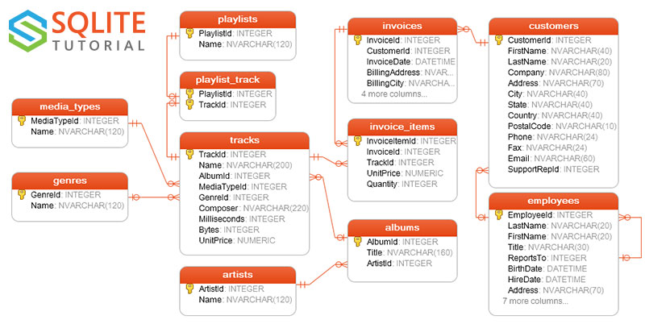

# SELF SERVE ANALYTICS

In the realm of data, a self-serve data platform denotes a system where users can effortlessly access data and extract meaningful information promptly. As a data engineer, managing numerous data requests is a common responsibility within the organization. Ensuring the accuracy and consistency of the provided data is also a key responsibility within the data team.

## Using GenerativeAI to utilize data engineering processes

With the advent of Large Language Models (LLMs) like OpenAI's GPT models and Google's Gemini model, leveraging LLMs can aid in faster retrieval of information from storage repositories, such as databases, using SQL agents. These agents assist in converting data requests into prompts that translate into actual SQL statements.
I decided to conduct an experiment using the Chinook sample open-source database to assess the performance of baseline SQL agents within the LangChain open-source framework. LangChain is a powerful tool empowering developers to utilize LLMs in creating customized applications, like chatbots. It provides SQL chains and agents for querying databases using natural language.

## Testing out LLMs to Query Databases

This repo is about exeperimenting the ability of Querying databases using natural language. This is possible by leveraging large language models such as OpenAI's gpt-3.5 with frameworks such as LangChain that offers SQL chains and Agents to build and run SQL queries based on natural language.

With this AI technology, We as data engineers are now a step closer in building self service data platforms where we can minimise the amount of time we answer to adhoc data requests from stakeholders. 

Here is the Entity Relation Diagram for the Chinook databases we using to do this exercise.

# Findings and Conclusion

From this exercise, it became apparent that substantial fine-tuning is necessary for the model to comprehend the business language that the database represents. This was evident in question three of my notebook, where the SQL agent overlooked a key filter under the WHERE clause, likely due to a lack of domain knowledge.

Lastly, similar to using ChatGPT, the structure of end-users' prompts is crucial and significantly influences the results of their requests. This was evident in my final question, where I obtained a result different from the one queried manually.